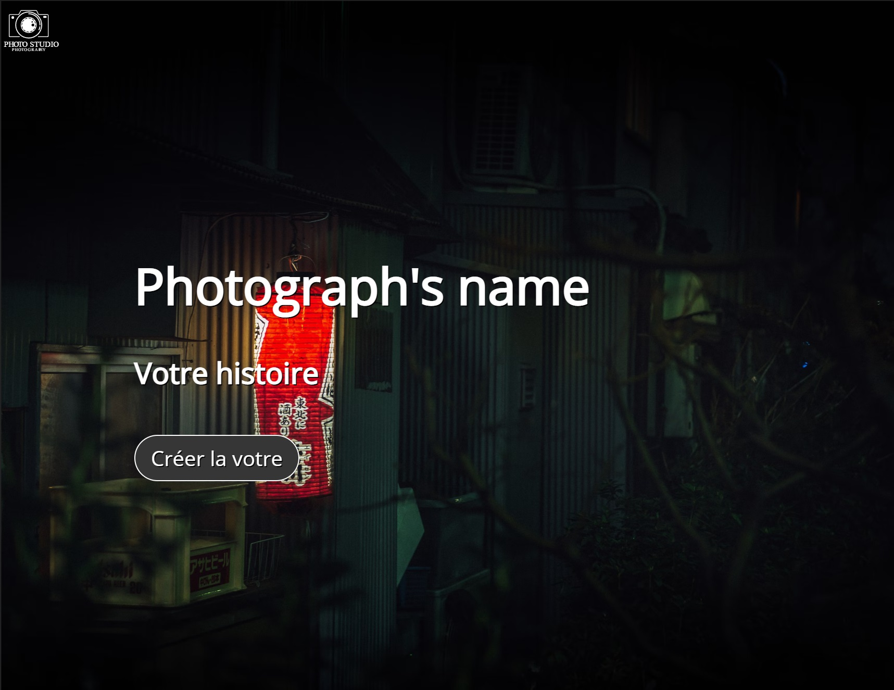
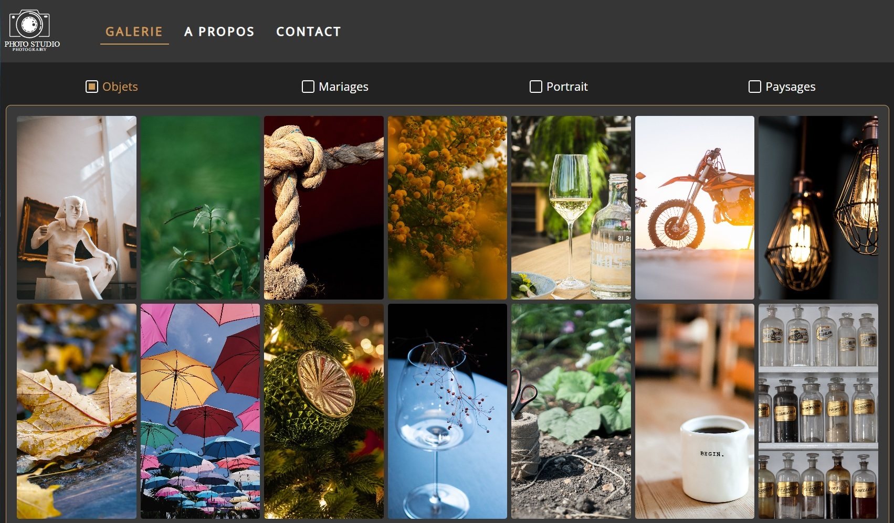
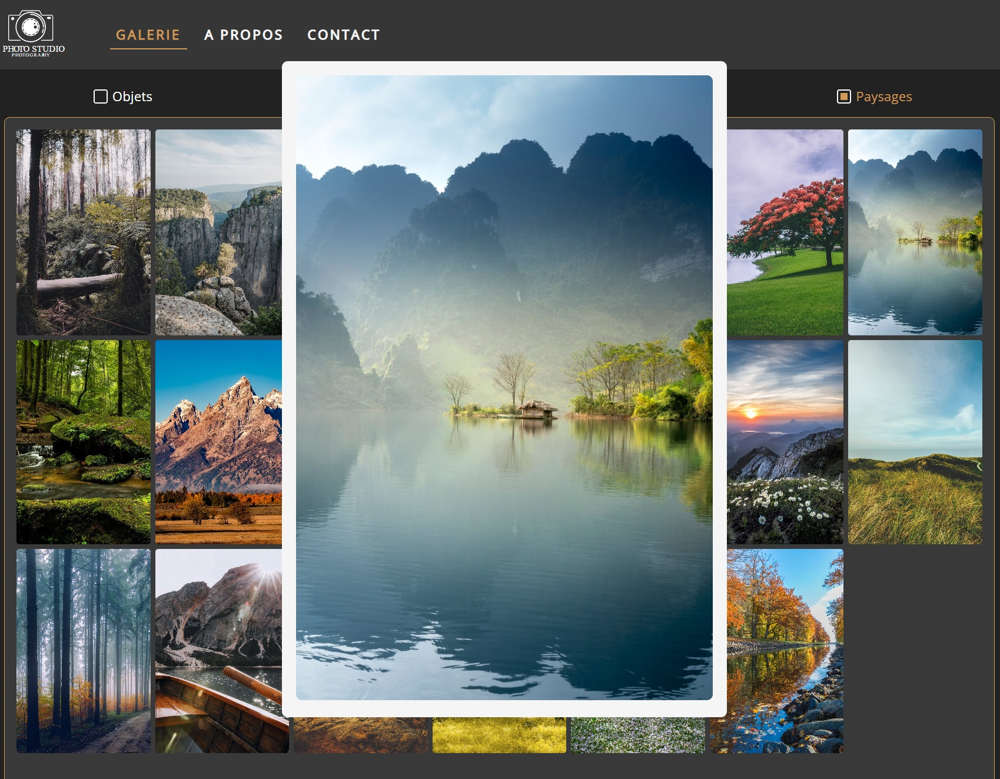
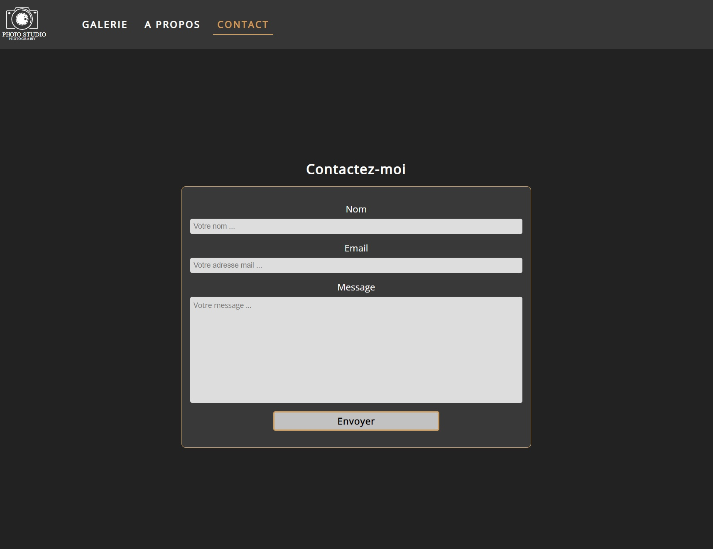

# My first react project - Photos Gallery

This project is my first react application that I made during the beginning of my professionnal retraining (summer 2021). There is a lot of mistakes inside the code but it was the opportunity for me to discover and try some libraries but also understand a lot of react's basic concepts.

For story, the idea to build a gallery was initiate by my cousin that were also at the beginning of his professionnal retraining in photography. So the goal was to create a website that can be a portfolio for him and can be easily be updated with new photos without any knowledge in web development and low cost.
Of course this project has not been used at the end, but think and manage job problematics was really interesting.

See the result [here](https://reactphotosgallery.netlify.app/).

## Technologies and libraries

#### For client app :
* ReactJS
* React Router V5
* React Spring
* EmailJS

#### For backend app :
* ExpressJS

#### Storage :
* Cloudinary

## Initialization

#### For backend app :
1. Clone this repo
2. Run command `cd Photos-Gallery_API` then `npm install`
3. To start server, run command `npm run server`

#### For client app :
1. Clone this [repo](https://github.com/Justine-Merlin/Photos-Gallery)
2. Run command `cd Photos-Gallery` then `npm install`
3. To start server, run command `npm start`

## Screenshots

